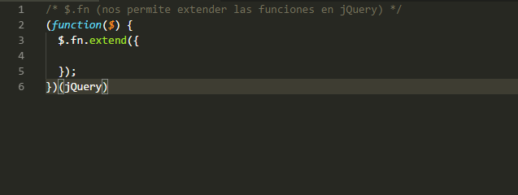

# Cardify

* **Track:** _Common Core_
* **Curso:** _JS Deep Dive: Crea tu propia librería usando JavaScript_
* **Unidad:** _Reto N° 2_
* **Desarrolladoras:** _Dayam Llerema, Lucero Hospina y Margarita Sutta._

***

**Cardify** es un plugin de jQuery, que dado un _contenedor_ busca todas las
imágenes que encuentre dentro del _contenedor_ y reemplaza por un nuevo
elemento `<figure>` que contenga la imagen (``) además de un `<figcaption>`
con el texto del atributo `alt` de la imagen.

***

## Flujo de trabajo en equipo

Para efectos de organización en el trabajo colaborativo se han creado tres ramas en este repositorio. Cada desarrolladora usará la rama asignada para ella de la siguiente manera:

* _Dayam Llerena_: [d-plugin](https://github.com/margb13/cardify/tree/d-plugin)

* _Lucero Hospina_: [l-plugin](https://github.com/margb13/cardify/tree/l-plugin)

* _Margarita Sutta_: [m-plugin](https://github.com/margb13/cardify/tree/m-plugin)

***

## Progreso propuesto

Se nos proponen los siguientes checklists de progreso para cada semana:

_**SEMANA 1.**_

* [X] Formar equipo.
* [X] Elegir reto.
* [x] Hacer fork de reto modelo o crear nuevo repo si has propuesto un reto no propuesto por Laboratoria.
* [x] Escribir primera versión del README.md con una descripción general de la librería así como ejemplos (snippets) de uso y configuración (si fuera necesario).
* [x] Crear issues y milestones que sirvan como hoja de ruta (roadmap)
* [x] Inicializar proyecto con npm init y git init.
* [x] Crear index.html con ejemplo principal de uso.

_**SEMANA 2.**_

* [ ] Agregar tests que describan la API de tu librería y los casos de uso esperados.
* [X] Implementar funcionalidad esencial.
* [ ] Hacer code review con tus compañeras e instructorxs.

**_SEMANA 3._**

* [x] Completar implementación de librería y ejemplo principal (usando la librería).
* [ ] Hacer code review con tus compañeras e instructorxs.
* [x] Preparar tu demo/presentación.
* [x] Publicar el ejemplo principal (index.html) en GitHub pages.

***

## Requisitos

Todos los retos deben incluir por los menos los siguientes archivos:

1. `README.md` con descripción del módulo, instrucciones de instalación, uso y documentación.
2. `index.js:` Librería debe exportar una función u objeto al entorno global (window) y hacer uso de _features de ES6_ donde sea apropiado.
3. `index.html:` Página web de la librería con ejemplo funcionando.
4. `package.json` con nombre, versión, descripción, autores, licencia, dependencias, scripts (pretest, test, ...).
5. `.eslintrc` con configuración para linter _(ver guía de estilo de JavaScript)_.
6. `.gitignore` para ignorar `node_modules` u otras carpetas que no deban incluirse en _control de versiones (git)_.

**Hacker edition (opcional):**

* Si la librería está dirigida al navegador, debe adherirse al patrón UMD para poder ser usado con AMD, CommonJS y como variable global del navegador.

* Integración continua con Travis o Circle CI

***

## Desarrollo del plugin

Como sabemos, jQuery es de las más potentes y utilizadas librerías de Javascript, reconocida como el propio framework de Javascript que se caracteriza por las funciones y eventos que implementa en este lenguaje.

Por lo que consideramos los siguientes puntos para la creación de nuestro plugin:

### I -Momenclatura del plugin

Hay un patrón generalizado de la nomenclatura de los plugins:

  ```javascript
  jquery.nombre_plugin.js
  ```

Lógicamente, siempre debes de incluír la librería jQuery antes del código de extensión.

> Referencias:
> [Momenclatura del script del plugin - Post de investigación 1](http://javascriptes.com/cul-es-la-convencin-de-nomenclatura-de-nombre-de-file-de-javascript.html), 
> [Momenclatura del script del plugin - Post de investigación 2](http://html5facil.com/tutoriales/como-crear-plugins-para-jquery/)

### II -Inicializar el plugin

La manera de inicializar el plugin de jQuery es básicamente obtener un parámetro “$” (signo de dólar), el cual representará nuestro objeto de jQuery; una vez obtenido el parámetro, extendemos su funcionalidad añadiendo “.fn.extend”

> Este método (extend) nos permite incrementar funcionalidad a jQuery, pues todo el código de nuestro plugin debe de ir definido dentro de él.

  

 Otra manera de inicializar.

  ``` javascript
    $.fn.cardify = function() {
    };
  ```

### III -Construyendo el plugin

Vamos a crear un método que debe buscar todas las imágenes que encuentre dentro del _contenedor_ y reemplazarlas por un nuevo elemento `<figure>` que contenga la imagen (``) además de un `<figcaption>` con el texto del atributo `alt` encapsulados dentro del objeto jQuery. Para ello vamos a usar el método genérico de jQuery llamado each(). Este método ejecuta una función en el contexto de cada elemento encontrado:

  ``` javascript
    $(this).find('img').each(function() {
      // Cada etiqueta img tomara como padre una etiqueta figure
      $(this).wrap('<figure></figure>');
      // A cada padre de la etiqueta img se le pondra como ultimo hijo una etiqueta figcaption
      // A cada figcaption se le pondra como texto el atributo de su imagen correspondiente
      $(this).parent().append($('<figcaption>' + $(this).attr('alt') + '</figcaption>'));

      // hover
      $(this).hover(function () {
        $(this).css('opacity', '0');
        $(this).next().css('display', 'none');
      }, function () {
        $(this).css('opacity', '1');
        $(this).next().css('display', 'block');
      });
    });
  ```
***

## Guía de uso

### Implementacion del plugin Cardify a un proyecto

Para el uso de nuestro plugin **_Cardify_** en tu proyecto debes incluir dos archivos importantes.

1. `jquery.cardify.css` en los que se incluyen los estilos necesarios para la implementación del funcionamiento correcto del plugin.

  ``` html
  <head>
    <meta charset="UTF-8">
    <meta name="viewport" content="width=device-width, initial-scale=1.0">
    <meta http-equiv="X-UA-Compatible" content="ie=edge">
    <!-- Ejemplo de vinculación de la hoja de estilos del plugin cardify -->
    <link rel="stylesheet" href="ruta-del-archivo/jquery.cardify.css">
    <title>Document</title>
  </head>
  ```

2. `jquery.cardify.js` que es el script donde se ha desarrollado la funcionalidad del plugin.

  ``` html
  <body>
    ...

    <!-- Ejemplo de vinculación del archivo js del plugin -->
    <script src="ruta-del-archivo/jquery.cardify.js"></script>
  </body>
  ```

### Uso

Para que el plugin de cardify aplique su funcionalidad, debemos implementar la siguiente línea de código al archivo propio Javascript del proyecto que el usuario haya creado.

``` javascript
// seleccionamos al contenedor que tenga la clase y luego que aplica la funcionalidad de cardify
$('.cardify-mode').cardify();
```

Este se aplicara de manera que buscara todos los elementos (``) que se encuentre dentro del **contenedor** con clase `.cardify-mode` , envolviendo cada imagen en un `<figure>` y añadiendo el `<figcaption>` con el texto del atributo alt de cada elemento (``).

### Ejemplo

La estructura inicial HTML a trabajar es un **contenedor** que contiene todos los elementos (``).

``` html
  <div class="container cardify-mode" id="hello">
    
    
    
    
    
    
    
    
    
    
    
    
    
    
    
  </div>
```

La estructura HTML del **contenedor** implementando el plugin quedará de la siguiente manera.

``` html
<div class="container cardify-mode">
    <figure class="figure-styles-inline"><figcaption class="figcaption-styles-inline">Relax yourself</figcaption></figure>
    <figure class="figure-styles-inline"><figcaption class="figcaption-styles-inline">Be Happy</figcaption></figure>
    <figure class="figure-styles-inline"><figcaption class="figcaption-styles-inline" style="opacity: 0;">Be Magic</figcaption></figure>
    <figure class="figure-styles-inline"><figcaption class="figcaption-styles-inline" style="opacity: 0;">Enjoy</figcaption></figure>
    <figure class="figure-styles-inline"><figcaption class="figcaption-styles-inline">Thank you :3</figcaption></figure>
    <figure class="figure-styles-inline"><figcaption class="figcaption-styles-inline">Dont Worry</figcaption></figure>
    <figure class="figure-styles-inline"><figcaption class="figcaption-styles-inline" style="opacity: 0;">Just be Happy</figcaption></figure>
    <figure class="figure-styles-inline"><figcaption class="figcaption-styles-inline" style="opacity: 0;">Good Morning Princess</figcaption></figure>
    <figure class="figure-styles-inline"><figcaption class="figcaption-styles-inline">Live your Live</figcaption></figure>
    <figure class="figure-styles-inline"><figcaption class="figcaption-styles-inline">Dont Worry</figcaption></figure>
    <figure class="figure-styles-inline"><figcaption class="figcaption-styles-inline">Be Magic</figcaption></figure>
    <figure class="figure-styles-inline"><figcaption class="figcaption-styles-inline">Thank you :3</figcaption></figure>
    <figure class="figure-styles-inline"><figcaption class="figcaption-styles-inline">Just be Happy</figcaption></figure>
    <figure class="figure-styles-inline"><figcaption class="figcaption-styles-inline">Enjoy</figcaption></figure>
    <figure class="figure-styles-inline"><figcaption class="figcaption-styles-inline">Be Happy</figcaption></figure>
  </div>
```
***

* _DEMO_: [demo](https://margb13.github.io/cardify/public/)

